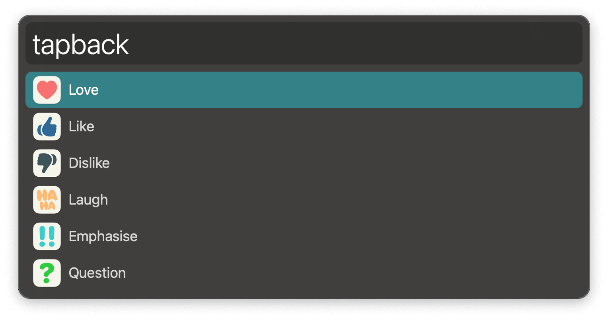
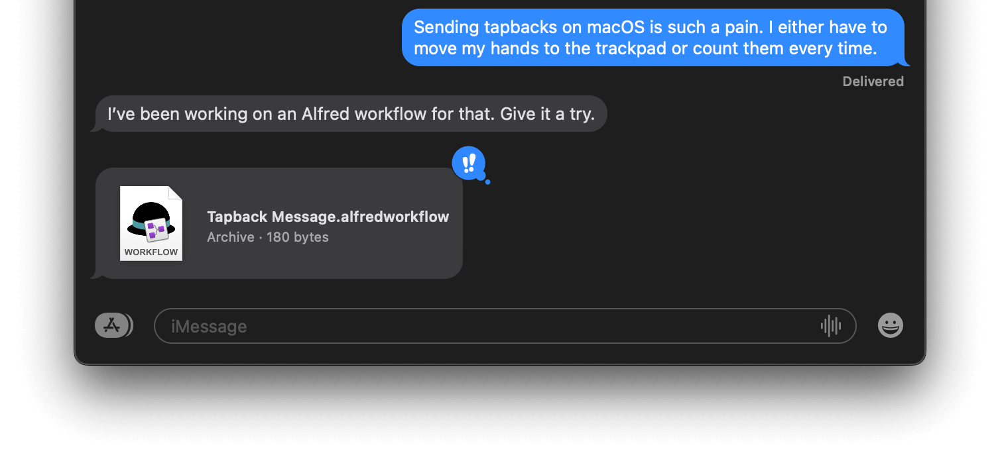

#  Tapback Message Alfred Workflow

Add a tapback reaction to the current message

[⤓ Install on the Alfred Gallery](https://alfred.app/workflows/alfredapp/tapback-message)

## Usage 

Send a tapback to the current message via the `tapback` keyword.

Configure the [Hotkeys](https://www.alfredapp.com/help/workflows/triggers/hotkey/) for faster triggering.
